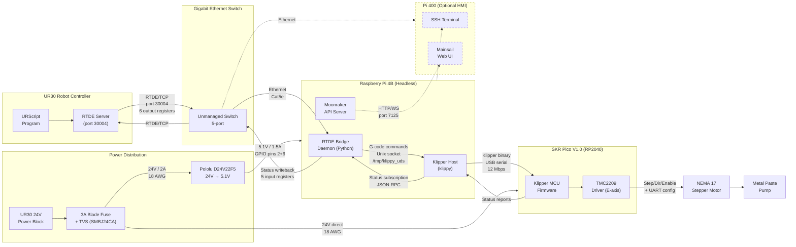

# System Block Diagram — Functions and Signals

**For:** Phase 2 Memo, Figure 1
**Author:** Willem
**Date:** 2026-02-12
**Status:** Rough draft — redraw in draw.io/Visio for Word submission

---

## Mermaid Diagram (for repo reference)

---

## Block Diagram Description (for redrawing in draw.io/Visio)

### Functional Blocks

| Block | Label | Shape | Notes |
|-------|-------|-------|-------|
| UR30 Robot Controller | "UR30 Controller" | Rectangle | Contains RTDE server + URScript program |
| Gigabit Switch | "Gigabit Switch" | Small rectangle | Unmanaged, 5-port |
| Raspberry Pi 4B | "Pi (Klipper Host + RTDE Bridge)" | Rectangle | Main control node |
| SKR Pico | "SKR Pico V1.0 (RP2040 + TMC2209)" | Rectangle | MCU + driver |
| Stepper Motor | "NEMA 17 Stepper" | Circle/oval | Actuator |
| Pump | "Metal Paste Pump" | Circle/oval | End effector |
| Pi 400 | "Pi 400 (HMI)" | Dashed rectangle | Optional |
| Power Distribution | "24V Power" | Rectangle (shaded) | Fuse + TVS + buck |

### Signal Paths (solid arrows)

| From | To | Label | Protocol | Direction |
|------|----|-------|----------|-----------|
| UR30 | Switch | "RTDE/TCP (port 30004)" | RTDE over TCP/IP | Bidirectional |
| Switch | Pi | "Ethernet (Cat5e)" | TCP/IP | Bidirectional |
| Pi (Bridge) | Pi (Klippy) | "Unix socket (/tmp/klippy_uds)" | Klipper JSON-RPC | Bidirectional |
| Pi (Klippy) | SKR Pico | "USB serial (12 Mbps)" | Klipper binary protocol | Bidirectional |
| SKR Pico (TMC2209) | Motor | "Step/Dir/Enable + UART" | GPIO + TMC2209 | Output |
| Motor | Pump | "Shaft coupling" | Mechanical | Output |

### Power Paths (thick/colored arrows)

| From | To | Label | Specs |
|------|----|-------|-------|
| UR30 Power Block | Fuse + TVS | "24V / 2A" | 18 AWG, 3A fuse, SMBJ24CA TVS |
| Distribution | SKR Pico VIN | "24V direct" | 18 AWG |
| Distribution | Buck Converter | "24V → 5.1V" | Pololu D24V22F5 |
| Buck Converter | Pi GPIO | "5.1V / 1.5A" | 22 AWG, 2A polyfuse |

### Feedback Path (dashed arrows, return direction)

| From | To | Data |
|------|----|------|
| TMC2209 | Klipper MCU | drv_status (UART: stall, OT, open load) |
| Klipper MCU | klippy host | Status reports (binary serial) |
| klippy host | Bridge daemon | Status subscription (JSON-RPC) |
| Bridge daemon | UR30 | 5 input registers (status, error, rate, ready, fault) |

### Optional Path (dashed, lighter)

| From | To | Label |
|------|----|-------|
| Switch | Pi 400 | "Ethernet (SSH, Mainsail)" |

---

## Figure Caption

**Figure 1.** System block diagram showing all functional blocks, communication protocols, power distribution, and feedback paths. The UR30 sends extrusion commands via RTDE to the Raspberry Pi, which translates them to Klipper G-code. The SKR Pico MCU generates step pulses for the TMC2209 stepper driver. Status feedback flows back through the same chain. Dashed elements (Pi 400) are optional and not in the real-time control loop. Power is distributed from the UR30's 24V power block through a blade fuse and TVS diode to both the SKR Pico (24V direct) and a buck converter (5.1V for the Pi).

---

## Key Points for the Memo Text

- **Closed-loop control architecture:** Commands flow forward (UR30 → Pi → SKR Pico → motor), status flows backward (motor → TMC2209 → Klipper → bridge → UR30)
- **Single real-time path:** UR30 → switch → Pi → SKR Pico (the Pi 400 is explicitly outside this path)
- **Protocol at each link:** RTDE/TCP, Unix socket JSON-RPC, Klipper binary serial, TMC2209 UART + step/dir GPIO
- **Power from a single source:** UR30 24V power block feeds the entire system
- **Estimated end-to-end latency:** 5–20 ms typical (see latency budget table)
